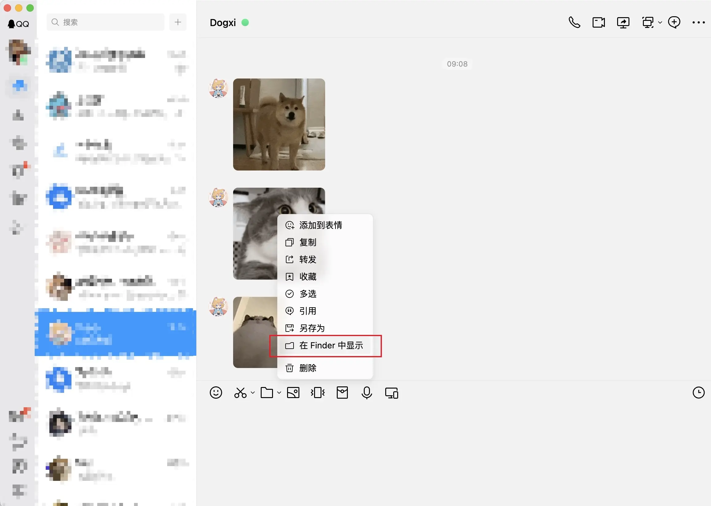

# 备份 QQ 收藏表情

- [备份 QQ 收藏表情](#备份-qq-收藏表情)
  - [一、获取本地表情包文件夹](#一获取本地表情包文件夹)
  - [二、脚本修复图片后缀](#二脚本修复图片后缀)
  - [Node.js 版本](#nodejs-版本)
  - [Python 版本](#python-版本)
    - [安装依赖](#安装依赖)
    - [运行](#运行)
  - [输出示例](#输出示例)
  - [支持的图片格式](#支持的图片格式)

<div align="center">
    
</div>

博客地址：[Dogxi 笔记本](https://blog.dogxi.me/backup-qq-emoji)

## 一、获取本地表情包文件夹

**QQnt**架构提供了可以直接显示图片所在文件夹的按钮，（右键图片/表情）`在 Finder 中显示`



点开以后会跳转到 **QQ** ~~瞎存图片~~ 的地方，

然后回退上级目录，直到 `nt_qq_xxxxxxx/nt_data/` 这里，再进入 `./Emoji/personal_emoji/` 目录，

这时候就能看到 一个 `Ori`（原图） 和 `Thumb` （缩略图）文件夹了，

`Ori` 文件夹可能跟现在**收藏表情**有出入，可以删除 `Ori` 文件夹，在**QQ**重新打开收藏表情**下滑加载**。

完成后，就可以把 `Ori` 文件夹拷贝一份出来了。

> [!NOTE]
>
> 在 `Ori` 文件夹你会发现有些应该是 GIF 动图，却是 JPG 后缀，这时候需要下面脚本处理（~~手动改也不是不行~~）

---

存储参考地址：

```markdown
# Windows

C:\Users\当前用户\Documents\Tencent Files\数字\nt_qq\nt_data\Emoji\personal-emoji

# Mac

/Users/当前用户/Library/Containers/com.tencent.qq/Data/Library/Application Support/QQ/nt_qq_加密字符串/nt_data/Emoji/personal-emoji
```

## 二、脚本修复图片后缀

先**下载**仓库源码，

**仓库**里有 `Nodejs` 和 `Python` 两种脚本（**任选其一**），

用于检测**指定目录**下图片文件的**真实格式**，并**自动修正**错误的文件扩展名。

只需要执行的时候，**命令**加上拷贝的 `Ori` 文件夹路径就可以了。

## Node.js 版本

```bash
# 指定目录
node ./nodejs/fix-images.js /path/to/your/images

# 直接运行（默认目录 ./Ori）
node ./nodejs/fix-images.js
```

## Python 版本

### 安装依赖

```bash
# 安装依赖
pip install aiofiles
```

### 运行

```bash
# 添加执行权限（macOS/Linux）
chmod +x fix-images.py

# 指定目录
python fix-images.py /path/to/your/images

# 直接运行（默认目录 ./Ori）
python fix-images.py
```

## 输出示例

```text
🚀 开始处理目录: ./Ori
正在检测和修复图片文件格式...

✅ 已重命名: CA101610D31985A94A0C2C7FB82A31C8.jpg -> CA101610D31985A94A0C2C7FB82A31C8.gif (jpg -> gif)
✅ 已重命名: FF0CD0893C70D0AF3987B136B3E2A01F.jpg -> FF0CD0893C70D0AF3987B136B3E2A01F.gif (jpg -> gif)
✓  格式正确: 016F338123974C2F8C0C7A3FD5B791FE.jpg (jpg)
...

==================================================
📋 处理完成统计:
   处理文件数: 425
   重命名文件数: 12
   跳过文件数: 0
   错误文件数: 0
   用时: 1.23秒
==================================================
```

## 支持的图片格式

- **JPEG** (.jpg, .jpeg) - 检测 JPEG 文件头 `FF D8 FF`
- **GIF** (.gif) - 检测 GIF87a 或 GIF89a 文件头
- **PNG** (.png) - 检测 PNG 文件头 `89 50 4E 47`
- **WebP** (.webp) - 检测 RIFF/WEBP 文件头
- **BMP** (.bmp) - 检测 BMP 文件头 `42 4D`
- **TIFF** (.tiff) - 检测 TIFF 文件头（大端/小端）
